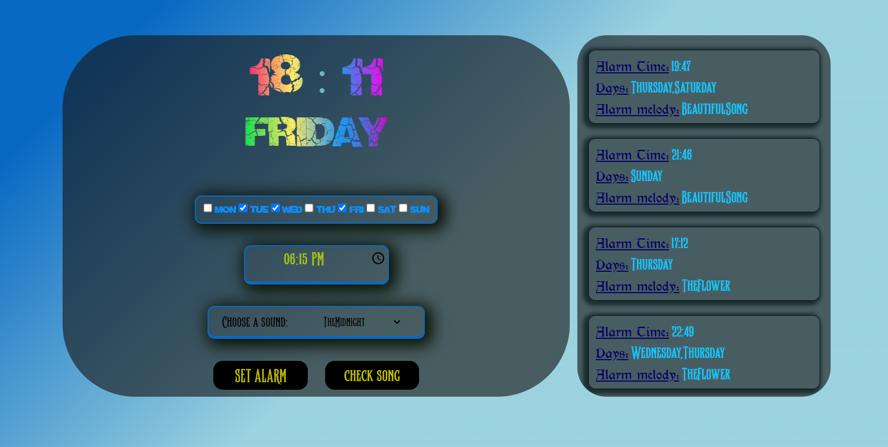

# Alarm App

This application is a simple alarm clock that allows users to set alarms and receive notifications at the specified time. The app provides a user-friendly interface for managing multiple alarms, and stores alarm data in `localStorage` to ensure persistence.

## Features

1. **Set Alarms**:
   - Users can set alarms by selecting the desired time.
   - Multiple alarms can be set, each with a unique label.
2. **Alarm Notification**:

   - When the alarm time is reached, the app displays a notification and plays a sound to alert the user.

3. **Persistent Storage**:

   - All alarms are stored in `localStorage`, ensuring that alarms are not lost even if the page is refreshed or closed.
   - Alarms are automatically reloaded when the app is reopened.

4. **User Interface**:
   - A clean and intuitive UI allows users to easily view, edit, or delete alarms.
   - The app shows a list of active alarms and the time remaining until each alarm goes off.

## Technologies Used

- **HTML**: Structure of the alarm interface and input forms.
- **CSS**: Styling for the alarm clock, notifications, and buttons.
- **JavaScript**: Core logic for managing alarm times, handling notifications, and interacting with `localStorage`.

## How to Use

1. Set the time for the alarm using the input field and add a label if desired.
2. Press the "Set Alarm" button to save the alarm.
3. When the alarm time is reached, a notification will alert you.
4. You can view, edit, or delete alarms from the list displayed on the screen.

